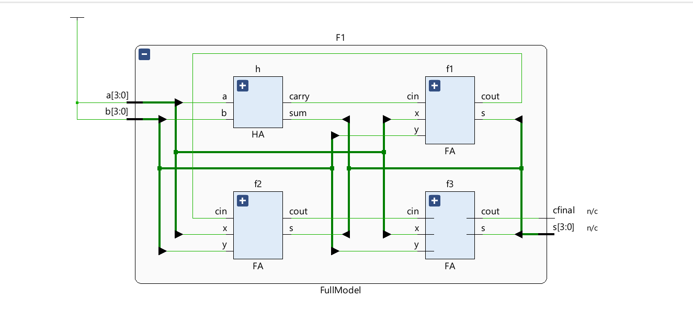
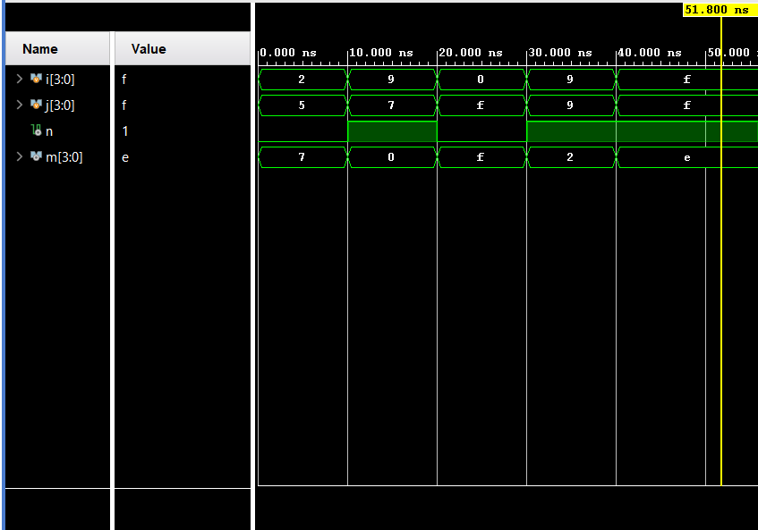

# 4-bit Ripple Carry Adder

* A structural and heirarchal implementation of 4-bit Ripple Carry Adder in verilog, simulated and verified using AMD Xilinx Vivado
* Wrote the testbench for the simulations results

## Schematic:

## Simulations:

